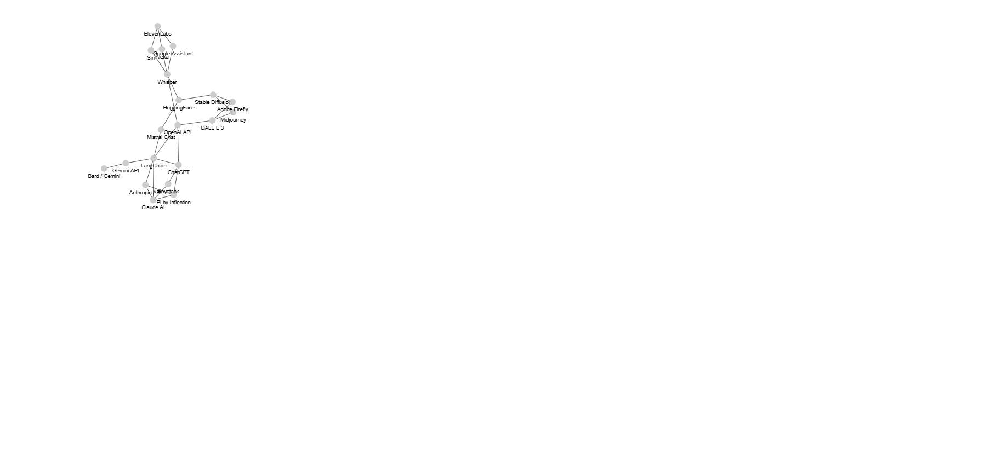

# ForceGraph Explorer v2.0.0

An interactive force-directed graph visualizer and comparison tool. 
Compare two datasets side by side, switch between visualizations, 
toggle dark/light mode, highlight differences, and export the result.

## Features

- Side-by-side dataset panels
- Force, Radial, and Galaxy layouts
- Dark/Light mode toggle
- Search by name and category
- Diff highlighting (added, deleted, common)
- Export diagnostics and save PNG snapshots

## PNG Files of the Activity

| Mode       | Panel 1                           | Panel 2                           |
|------------|-----------------------------------|-----------------------------------|
| Light Mode |  |  |
| Dark Mode  |    |    |

## Directory Structure

```
.
├── index.html
├── js/
├── css/
├── data/
├── png/
├── README.md
├── .gitignore
└── requirements.md
```

## Getting Started

Simply clone the repo and open `index.html` in your browser.

---

## Coming in v3.0.0

- A “Reset Colors” button to restore the original node colors
- 3D Force Graph support
- Additional sample datasets

---

## License

MIT License
